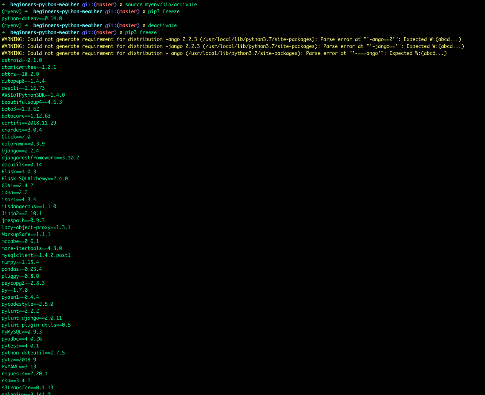

## Main information docs: 
https://docs.python.org/3/library/venv.html

https://packaging.python.org/guides/installing-using-pip-and-virtual-environments/#creating-a-virtual-environment


## Why to use virtual environment?
To isolate environment from the global environments and having same Python pip libraries as the project obtains is what venv is mainly used for. 
Sometimes the project may require specific libraries to work as syntax of the libraries may change or they are depended on another older libraries.

Below in the picture the first pip3 freeze shows the pip libraries in the virtualenvironment scope. 
Next, when deactivating the virtual environment, the global pip libraries of the system is a looong list of different library versions. 


## Commands to run virtual environments
Note: It's easiest to be in the main folder to do the commands -> /beginners-python-weather

Note 2: first venv = the command & later venv = the environment name
`py/python3 -m venv(command) venv(name)`

### Windows

**Command Prompt:**

Create a venv
```
py -m venv venv
```
Activate venv
```
.\venv\Scripts\activate
```
Deactivate venv
```
deactivate
```
Delete venv
```
RMDIR /Q/S venv
```

**Powershell:** 

Create a venv
```
py -m venv venv
```
Activate venv
```
. .\venv\Scripts\activate.ps1
```
Deactivate venv
```
deactivate
```
Delete venv
```
Remove-Item venv -Recurse
```

**Git Bash:**

Create a venv
```
python -m venv venv
```
Activate venv
```
source venv/Scripts/activate
```
Deactivate venv
```
deactivate
```
Delete venv
```
rm -rf venv
```
### Mac/Linux

Create a venv
```
python3 -m venv venv
```
Activate venv
```
source venv/bin/activate
```
Deactivate venv
```
deactivate
```
Delete venv
```
rm -rf venv
```

### Install libraries from requirements.txt

Commonly `requirements.txt` is used for listing needed libraries and versions for the projectvirtual environment. When creating a new venv, the libraries needed for the project are needed to be installed with following:

Windows:

`pip install -r requirements.txt`

Mac/Linux:

`pip3 install -r requirements.txt`
